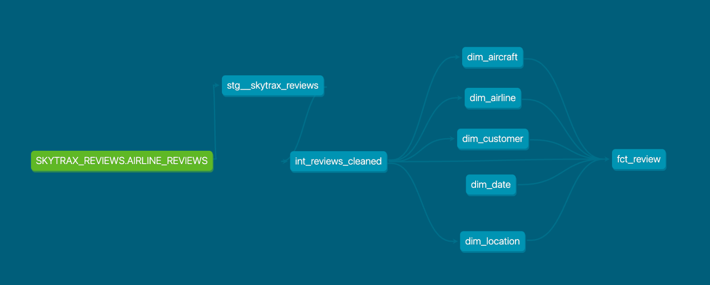
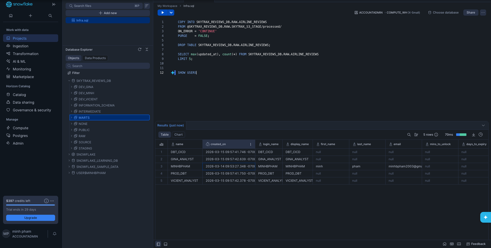
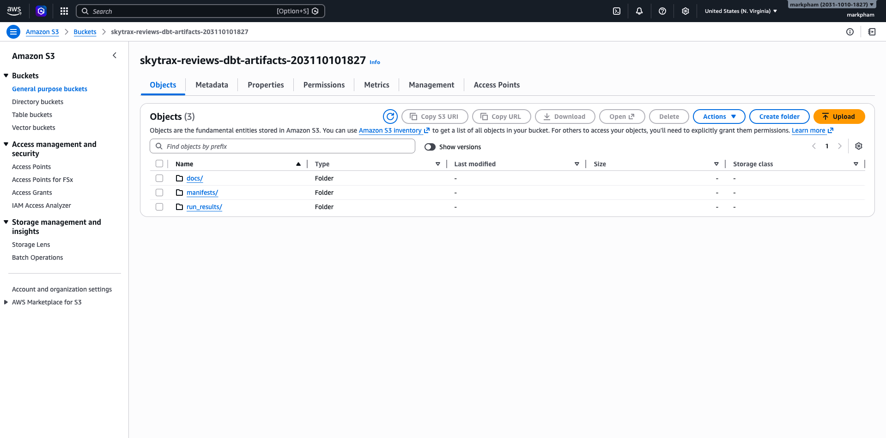
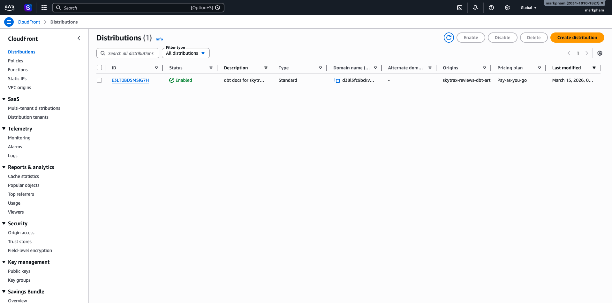

# Skytrax Reviews Transformation & CI/CD Pipeline (Part 2)


At Insurify, I run `dbt build --defer --favor-state` every day and curl the production manifest from S3 before every CI run — but I never fully understood what was happening under the hood. How does the manifest get there? Who uploads it? How does OIDC actually work? Why do we need a separate CI schema?

This project is my attempt to build all of that from scratch. I spent a full day setting up a proper CI/CD pipeline and local dev environment for a small team of 3 analysts — configuring slim CI with merge-base state comparison, uploading manifests to S3 after every deploy, hosting dbt docs on CloudFront, wiring up OIDC so GitHub Actions never touches a static AWS credential, and managing every piece of Snowflake infrastructure (users, roles, schemas, warehouses, grants) through Terraform.

[Part 1 (Extract-Load)](https://github.com/MarkPhamm/skytrax_reviews_extract_load) scrapes 160,000+ airline reviews from AirlineQuality.com and loads them into Snowflake. This project picks up where that left off — transforming raw reviews into a star schema, with full CI/CD, Infrastructure as Code, and orchestration.

- **Star schema** — Kimball methodology with 5 dimensions and 1 fact table, deterministic surrogate keys
- **Slim CI** — only changed models are linted, compiled, run, and tested on PRs via merge-base state comparison
- **Incremental CD** — `--defer --favor-state` deploys only modified models + downstream, falls back to full build on first run
- **Keyless auth** — GitHub Actions authenticates to AWS via OIDC, no static credentials
- **Full IaC** — Snowflake users, roles, grants, schemas, warehouses + AWS S3, CloudFront, OIDC — all managed by Terraform
- **Per-user dev schemas** — each developer gets their own isolated schema for local dbt development
- **dbt Docs** — auto-generated and hosted on CloudFront, updated on every deploy: [Live Docs](https://d38l3fc9bckvbz.cloudfront.net)

## Architecture

```text
                    ┌──────────────────────────────┐
                    │   Snowflake                  │
                    │   SKYTRAX_REVIEWS_DB.RAW     │
                    │   .AIRLINE_REVIEWS           │
                    │   (from Part 1)              │
                    └──────────────┬───────────────┘
                                   │ dbt source
                                   ▼
                    ┌──────────────────────────────┐
                    │   SOURCE schema              │
                    │   stg__skytrax_reviews (view)│
                    └──────────────┬───────────────┘
                                   │
                                   ▼
                    ┌──────────────────────────────┐
                    │   INTERMEDIATE schema        │
                    │   int_reviews_cleaned (view)  │
                    └──────────────┬───────────────┘
                                   │
                    ┌──────┬───────┼───────┬───────┐
                    ▼      ▼       ▼       ▼       ▼
                ┌──────────────────────────────────────┐
                │   MARTS schema                       │
                │   dim_customer  dim_airline           │
                │   dim_aircraft  dim_location          │
                │   dim_date      fct_review            │
                └──────────────────────────────────────┘
                                   │
                    ┌──────────────┼──────────────┐
                    ▼              ▼              ▼
               GitHub Actions   Airflow       BI Tools
               (CI/CD)         (scheduling)   (analytics)
```

## Stack

| Layer | Technology |
| ----- | ---------- |
| Data Warehouse | Snowflake |
| Transformation | dbt (dbt-snowflake) |
| Orchestration | Apache Airflow (Astronomer, cosmos) |
| IaC | Terraform (AWS + Snowflake) |
| CI/CD | GitHub Actions (slim CI, defer/favor-state CD) |
| Auth | AWS IAM OIDC (keyless) |
| Artifact Storage | AWS S3 (manifests, run_results, docs) |
| Docs Hosting | AWS CloudFront + S3 |
| Linting | SQLFluff |
| Language | SQL, Python 3.12, Jinja |

## Data Model

### Star Schema

Follows **Kimball star schema** methodology with deterministic surrogate keys (`dbt_utils.generate_surrogate_key`).

**Grain**: one row per customer review per flight.

| Model | Type | Description |
|-------|------|-------------|
| `fct_review` | Fact | Review metrics, ratings, calculated averages, and rating bands |
| `dim_customer` | Dimension | Reviewer identity and flight count |
| `dim_airline` | Dimension | Airline name |
| `dim_aircraft` | Dimension | Aircraft model, manufacturer, seat capacity |
| `dim_location` | Dimension | City + airport (role-playing: origin, destination, transit) |
| `dim_date` | Dimension | Calendar + fiscal dates (role-playing: submitted, flown) |

### dbt Docs & Lineage Graph

Full documentation is auto-generated and hosted on CloudFront: **[Live dbt Docs](https://d38l3fc9bckvbz.cloudfront.net)**



## Snowflake Infrastructure

All Snowflake resources are managed by Terraform — users, roles, grants, schemas, warehouses. No manual setup in the Snowflake UI.

### Schema Layout

| Schema | Purpose | Target |
|--------|---------|--------|
| `RAW` | Raw source data (seeds, external loads) | one-off |
| `SOURCE` | Staging views — 1:1 source mirrors | prod |
| `INTERMEDIATE` | Cleaned/normalized business logic | prod |
| `MARTS` | Star schema dims + facts | prod |
| `STAGING` | CI scratch space (all models flat) | CI only |
| `DEV_*` | Per-user dev schemas | local dev |

### Users & RBAC

Every user, role, and grant is defined in Terraform. Analysts get read-only access to `MARTS` plus write access to their own dev schema. Service accounts (`PROD_DBT`, `DBT_CICD`) use the transformer role for production and CI.



| Resource | Details |
|----------|---------|
| Database | `SKYTRAX_REVIEWS_DB` |
| Warehouses | 5 sizes: `SKYTRAX_COMPUTE_XSMALL` through `XLARGE` |
| Roles | `SKYTRAX_ADMIN` > `SKYTRAX_TRANSFORMER` + `SKYTRAX_ANALYST` |
| Service Accounts | `PROD_DBT`, `DBT_CICD` (transformer role) |
| Analyst Users | `GINA_ANALYST`, `VICIENT_ANALYST` (analyst role) |

## AWS Infrastructure

### S3 Artifacts

dbt manifests, run results, and docs are stored in a versioned, encrypted S3 bucket. The CD pipeline uploads after every deploy; the CI pipeline downloads the production manifest for state comparison.



### CloudFront (dbt Docs)

dbt docs are served globally via CloudFront with Origin Access Control — the S3 bucket stays private, CloudFront handles HTTPS and caching. Cache is invalidated on every deploy so docs are always up to date.



| Resource | Purpose |
|----------|---------|
| S3 Bucket | dbt artifacts (manifests, run_results, docs) — versioned, encrypted |
| CloudFront | CDN for dbt docs hosting (free tier, no server needed) |
| OIDC Provider | GitHub Actions keyless authentication |
| IAM Role | CI/CD role with S3 read/write + CloudFront invalidation (assumed via OIDC) |

## CI/CD Pipeline

See [docs/cicd.md](docs/cicd.md) for full details.

### Continuous Deployment (merge to `main`)

Uses **defer/favor-state** for incremental deploys — only modified models and their downstream dependencies are rebuilt:

```text
1. Checkout code + configure AWS via OIDC
2. Download production manifest from S3 (if exists)
3. dbt build --select state:modified+ --defer --favor-state --state prod_state
4. Generate and upload dbt docs to S3
5. Invalidate CloudFront cache
6. Upload manifest + run_results to S3 for next deploy
7. Email notification
```

Falls back to a full build if no prior manifest exists (first run).

### Continuous Integration (pull requests)

Uses **merge-base state comparison** — only changed models are linted, compiled, run, and tested:

```text
1. Build merge-base manifest (state baseline from main)
2. Detect changed models (state:modified + state:new)
3. Lint changed SQL files with SQLFluff
4. Compile changed models
5. Run changed models with --defer to base state
6. Test changed models with --defer to base state
```

## Getting Started

Follow these guides in order:

### 1. [Infrastructure Setup](docs/infrastructure.md)

Provision Snowflake RBAC, warehouses, schemas, and AWS resources with Terraform.

### 2. [Local Development](docs/local-development.md)

Set up your dev environment, run dbt locally, and start the Airflow scheduler.

### 3. [CI/CD Pipeline](docs/cicd.md)

Configure GitHub secrets, understand the slim CI and defer/favor-state CD workflows.

### 4. [dbt Docs Hosting](docs/dbt_docs.md)

How we host dbt docs with CloudFront + S3 (and why we switched from EC2).

## Quick Reference

```bash
# Install dependencies (local dev)
pip install -r requirements-dev.txt

# Set Snowflake env vars
export SNOWFLAKE_ACCOUNT=nvnjoib-on80344
export SNOWFLAKE_USER=your_user
export SNOWFLAKE_PASSWORD=your_password
export SNOWFLAKE_ROLE=SKYTRAX_ANALYST
export SNOWFLAKE_SCHEMA=DEV_your_name

# Run dbt
cd dbt
dbt deps --profiles-dir ./
dbt debug --profiles-dir ./
dbt run --profiles-dir ./

# Start Airflow
cd dbt-dags
astro dev start

# Infrastructure
cd terraform/snowflake && terraform init && terraform apply
cd terraform/aws && terraform init && terraform apply
```

## Directory Layout

```text
dbt/                        dbt project
  models/
    staging/                1:1 source mirrors (views)
    intermediate/           Cleaned business logic (views)
    marts/                  Star schema dims + facts (tables)
  macros/                   generate_schema_name, generate_dates_dimension
  profiles.yml              Snowflake connection (env vars)
dbt-dags/                   Astronomer/Airflow project
  dags/
    transformation_dag.py   cosmos DbtDag (PROD_DBT user)
terraform/
  snowflake/                RBAC, users, warehouses, schemas
  aws/                      S3, CloudFront, OIDC, IAM
.github/
  workflows/
    deploy_main.yml         CD: defer/favor-state deploy
    pr_checks.yml           CI: slim CI on changed models
  actions/
    dbt-ci-init/            Composite action: Python, venv, dbt deps
docs/                       Setup guides
assets/                     Screenshots (AWS, Snowflake, dbt)
requirements.txt            CI dependencies (dbt, sqlfluff)
requirements-dev.txt        Local dev dependencies (+ pandas, ipykernel)
setup.cfg                   SQLFluff config
```

## GitHub Secrets

| Secret | Description |
|--------|-------------|
| `SNOWFLAKE_ACCOUNT` | `nvnjoib-on80344` |
| `SNOWFLAKE_USER` | `DBT_CICD` |
| `SNOWFLAKE_PASSWORD` | Password for DBT_CICD user |
| `SNOWFLAKE_ROLE` | `SKYTRAX_TRANSFORMER` |
| `AWS_ROLE_ARN` | IAM role ARN for OIDC (from `terraform output`) |
| `S3_ARTIFACTS_BUCKET` | S3 bucket name for artifacts |
| `CLOUDFRONT_DISTRIBUTION_ID` | CloudFront distribution ID for cache invalidation |
| `EMAIL_USERNAME` | Gmail address for deploy notifications |
| `EMAIL_PASSWORD` | Gmail app password |

## Workflow Status

[](https://github.com/MarkPhamm/skytrax_reviews_transformation/actions/workflows/deploy_main.yml)
[](https://github.com/MarkPhamm/skytrax_reviews_transformation/actions/workflows/pr_checks.yml)
