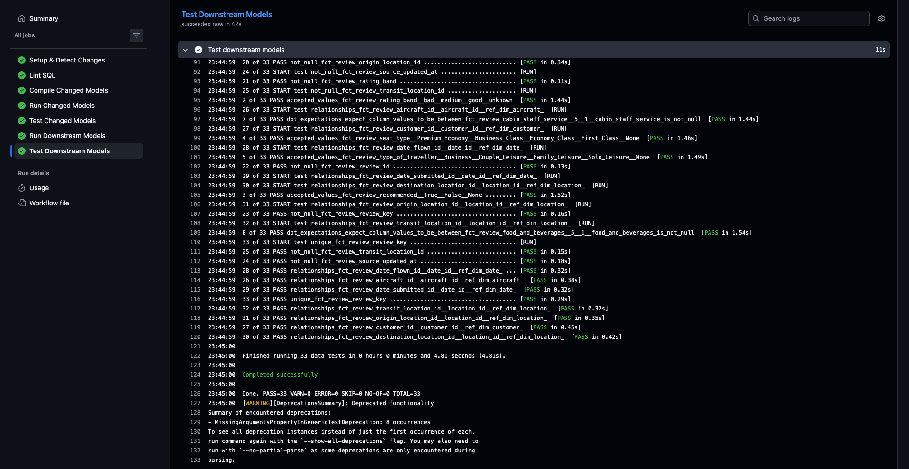

Hi everyone, I'm Mark - Analytics Engineer at Insurify.

**TLDR:** Part 2 - Transformation pipeline that takes 160,000+ raw airline reviews from Snowflake (loaded in [Part 1](https://github.com/MarkPhamm/skytrax_reviews_extract_load)) and transforms them into a Kimball star schema using dbt, with full CI/CD (slim CI + defer/favor-state CD), Infrastructure as Code (Terraform for Snowflake RBAC + AWS), and auto-hosted dbt docs on CloudFront.

This is the second part of my series where I build end-to-end data pipelines following best practices I learned at Insurify. In [Part 1](https://github.com/MarkPhamm/skytrax_reviews_extract_load), we built the ingestion pipeline — scraping airline reviews, staging them in S3, and loading into Snowflake. Now we pick up where that left off: transforming raw data into analytical models, setting up proper access control for a small team, and building a CI/CD pipeline that only rebuilds what changed.

At Insurify, I run `dbt build --defer --favor-state` every day and curl the production manifest from S3 before every CI run — but I never fully understood what was happening under the hood. How does the manifest get there? Who uploads it? How does OIDC actually work? Why do we need a separate CI schema? This project is my attempt to build all of that from scratch.

# The Transformation Pipeline

Overall architecture details can be found [here](https://github.com/MarkPhamm/skytrax_reviews_transformation/blob/main/README.md).

Tech stacks:

- dbt (dbt-snowflake): Transformation layer — Kimball star schema
- Snowflake: Data warehouse — all RBAC managed by Terraform
- Terraform: Infrastructure as Code — Snowflake + AWS resources
- GitHub Actions: CI/CD — slim CI on PRs, defer/favor-state CD on merge
- AWS S3: Artifact storage — manifests, run results, dbt docs
- AWS CloudFront: CDN for hosting dbt docs
- AWS IAM OIDC: Keyless authentication for GitHub Actions
- SQLFluff: SQL linting — lowercased keywords, trailing commas, explicit aliases
- Apache Airflow (Astronomer, cosmos): Orchestration

```text
Snowflake RAW.AIRLINE_REVIEWS (from Part 1)
    │ dbt source
    ▼
stg__skytrax_reviews (view) → int_reviews_cleaned (view) → Star Schema (tables)
                                                             ├── dim_customer
                                                             ├── dim_airline
                                                             ├── dim_aircraft
                                                             ├── dim_location
                                                             ├── dim_date
                                                             └── fct_review
```

# Prerequisite

I would expect you have completed [Part 1](https://github.com/MarkPhamm/skytrax_reviews_extract_load) so you have a Snowflake account with raw data loaded. You'll also need:

- An AWS account (free tier is more than enough)
- The `terraform-admin` AWS CLI profile from Part 1
- Python 3.12+
- Git
- Docker (for local Airflow)

If you haven't set up AWS or Terraform, follow the guides in [Part 1 Steps 3-4](https://github.com/MarkPhamm/skytrax_reviews_extract_load/blob/main/docs/ARTICLE.md).

# Step 1: Clone the repo and set up your environment

The repo link is here: <https://github.com/MarkPhamm/skytrax_reviews_transformation>. Clone it and set up a Python virtual environment:

```bash
git clone https://github.com/MarkPhamm/skytrax_reviews_transformation.git
cd skytrax_reviews_transformation

python -m venv dbt_venv
source dbt_venv/bin/activate
pip install -r requirements-dev.txt
```

`requirements-dev.txt` includes dbt-snowflake, sqlfluff, pandas, and other dev tools. The production CI only uses `requirements.txt` (dbt + sqlfluff).

# Step 2: Set up Snowflake Infrastructure with Terraform

Before we can run dbt, we need to create the Snowflake database, schemas, roles, users, and warehouses. Instead of clicking around the Snowflake UI, everything is defined as code in `terraform/snowflake/`. No manual setup — just `terraform apply`.

## 2.1 What Terraform creates for us

The Snowflake Terraform code is split across 7 files, each handling one concern:

```text
terraform/snowflake/
├── providers.tf     # How Terraform connects to Snowflake
├── variables.tf     # Input definitions (passwords, account info, defaults)
├── main.tf          # Shared locals (warehouse sizes, schema maps)
├── warehouses.tf    # Compute warehouses (XSMALL → XLARGE)
├── databases.tf     # Database + all schemas
├── roles.tf         # Roles + role hierarchy
├── grants.tf        # All privilege grants + ownership transfers
├── users.tf         # Users + role-to-user assignments
├── outputs.tf       # Values printed after apply (for CI/CD config)
└── terraform.tfvars # Actual secret values (never committed)
```

Let me walk through what each file creates.

### `providers.tf` — Snowflake connection

Tells Terraform how to authenticate with Snowflake. It uses `ACCOUNTADMIN` because it needs full power to create roles, users, and grants. All credentials come from variables (defined in `variables.tf`, values in `terraform.tfvars`) so nothing sensitive is hardcoded.

### `variables.tf` — Input definitions

Declares every input Terraform needs: Snowflake org/account, admin credentials, user passwords, database name, and warehouse auto-suspend timeout. Passwords are marked `sensitive = true` so Terraform redacts them from all output. Variables with a `default` (like `database_name = "SKYTRAX_REVIEWS_DB"`) are optional — the rest are required and must be provided in `terraform.tfvars`.

### `main.tf` — Shared locals

Contains `locals` blocks — internal variables reused across other files. Three maps:
- `warehouse_sizes` — list of warehouse sizes to loop over (`XSMALL` through `XLARGE`)
- `prod_schemas` — the 5 production schemas that the transformer role needs access to
- `dev_schemas` — per-developer schemas (adding a new analyst here automatically grants them permissions via the loops in `grants.tf`)

### `warehouses.tf` — Compute warehouses

Creates 5 warehouses of increasing size using a `for_each` loop over `warehouse_sizes`:

| Warehouse | Size | Use case |
| --------- | ---- | -------- |
| `SKYTRAX_COMPUTE_XSMALL` | XS | Default for all users — CI/CD, dev, analysts |
| `SKYTRAX_COMPUTE_SMALL` | S | Moderate queries |
| `SKYTRAX_COMPUTE_MEDIUM` | M | Heavier transformations |
| `SKYTRAX_COMPUTE_LARGE` | L | Large rebuilds |
| `SKYTRAX_COMPUTE_XLARGE` | XL | Full refreshes |

All warehouses have `auto_suspend = 60` (shuts down after 60 seconds of inactivity) and `auto_resume = true` (wakes up when a query hits it). This keeps costs near zero when nobody is running queries.

### `databases.tf` — Database and schemas

Creates the database `SKYTRAX_REVIEWS_DB` and 9 schemas inside it:

| Schema | Purpose |
| ------ | ------- |
| `RAW` | Seed data loaded by `dbt seed` (one-off) |
| `SOURCE` | Staging views — 1:1 source mirrors |
| `INTERMEDIATE` | Cleaned/normalized business logic views |
| `MARTS` | Star schema dims + facts (tables for BI tools) |
| `STAGING` | CI scratch space — used only during PR checks |
| `DEV_MINH` | Development schema for Minh |
| `DEV_GINA` | Development schema for Gina |
| `DEV_VICIENT` | Development schema for Vicient |
| `DEV_DEREK` | Development schema for Derek |

Why separate schemas for each environment? At Insurify, we follow the same pattern. Production models go to `SOURCE`/`INTERMEDIATE`/`MARTS`, CI runs write to `STAGING` (flat, gets wiped after each PR), and each developer gets their own `DEV_*` schema so they can run dbt locally without stepping on each other's toes.

### `roles.tf` — Roles and hierarchy

Creates three project-scoped roles and wires them into a hierarchy:

```text
ACCOUNTADMIN
  └── SYSADMIN
        └── SKYTRAX_ADMIN (full control over project database)
              ├── SKYTRAX_TRANSFORMER (read/write on production schemas)
              └── SKYTRAX_ANALYST (read-only on MARTS + write on own dev schema)
```

The `TRANSFORMER` role is what dbt uses in CI/CD and production — it can create/replace tables and views in all production schemas. The `ANALYST` role is for humans — they can only read from `MARTS` and write to their own dev schema. Wiring `SKYTRAX_ADMIN` up to `SYSADMIN` follows Snowflake best practices so all custom roles are accessible from the top.

### `grants.tf` — Privileges and ownership

The largest file — handles all permission grants. It uses `for_each` loops over `local.prod_schemas` and `local.dev_schemas`, so adding a new schema to those maps in `main.tf` automatically propagates permissions. The grants break down into:

- **Warehouse grants** — TRANSFORMER gets USAGE + OPERATE, ANALYST gets USAGE only, ADMIN gets full control
- **Database grants** — TRANSFORMER gets USAGE + CREATE SCHEMA, ANALYST gets USAGE only, ADMIN gets all privileges
- **Schema grants** — TRANSFORMER gets USAGE + CREATE TABLE/VIEW on all production schemas; ANALYST gets USAGE on MARTS only + full read/write on dev schemas
- **Future grants** — Automatically apply permissions to any tables/views created in the future (critical for dbt, which creates new objects on every run)
- **Ownership grants** — Transfers ownership of all current and future tables/views in production schemas to TRANSFORMER. This is needed because dbt uses `CREATE OR REPLACE`, which requires ownership

### `users.tf` — Users and role assignments

Creates 5 users and assigns each one a role:

| User | Role | Purpose |
| ---- | ---- | ------- |
| `PROD_DBT` | SKYTRAX_TRANSFORMER | Production dbt runs (Airflow) |
| `DBT_CICD` | SKYTRAX_TRANSFORMER | GitHub Actions CI/CD |
| `GINA_ANALYST` | SKYTRAX_ANALYST | Analyst (Gina) |
| `VICIENT_ANALYST` | SKYTRAX_ANALYST | Analyst (Vicient) |
| `DEREK_ANALYST` | SKYTRAX_ANALYST | Analyst (Derek) |

Each user gets a default warehouse (`XSMALL`), default role, and default namespace (database.schema). The two service accounts (`PROD_DBT` and `DBT_CICD`) both use the TRANSFORMER role but are kept separate so you can audit who did what and revoke one without affecting the other. `PROD_DBT` is for the Airflow scheduler running daily production builds. `DBT_CICD` is for GitHub Actions — it runs in the `STAGING` schema during PRs and deploys to production schemas on merge.

### `outputs.tf` — Post-apply values

Prints useful values after `terraform apply` — database name, warehouse names, usernames, role names, and schema names. These are handy for configuring dbt profiles, CI/CD pipelines, and BI tool connections.

## 2.2 Configure your variables

```bash
cp terraform/snowflake/terraform.tfvars.example terraform/snowflake/terraform.tfvars
```

Edit `terraform/snowflake/terraform.tfvars`:

```hcl
snowflake_organization_name = "MYORG"
snowflake_account_name      = "MYACCOUNT"
snowflake_admin_user        = "your_username"
snowflake_admin_password    = "your_password"

prod_dbt_password        = "choose_a_password"
cicd_user_password       = "choose_a_password"
gina_analyst_password    = "choose_a_password"
vicient_analyst_password = "choose_a_password"
derek_analyst_password   = "choose_a_password"
```

You can find your org and account from your Snowflake URL: `https://MYORG-MYACCOUNT.snowflakecomputing.com`.

## 2.3 Plan and Apply

```bash
cd terraform/snowflake
terraform init
terraform plan
terraform apply
```

Type `yes` when prompted. Terraform creates the entire Snowflake infrastructure — database, schemas, warehouses, roles, users, grants, and ownership transfers. You should see around 50+ resources being created.

## 2.4 Verify in Snowflake

Log in to the Snowflake UI and verify:

- You should see `SKYTRAX_REVIEWS_DB` with all the schemas
- Under Admin → Users & Roles, you should see the 4 new users and 3 new roles
- Under Admin → Warehouses, you should see the 5 compute warehouses


# Step 3: Run dbt locally

Now the Snowflake infrastructure is ready. Let's connect dbt to it and run our models.

## 3.1 Set environment variables

Set these based on your Snowflake user. Each developer gets their own dev schema:

```bash
export SNOWFLAKE_ACCOUNT=nvnjoib-on80344
export SNOWFLAKE_USER=your_user
export SNOWFLAKE_PASSWORD=your_password
export SNOWFLAKE_ROLE=SKYTRAX_ANALYST
export SNOWFLAKE_SCHEMA=DEV_your_name  # e.g., DEV_MINH
```

Add these to your `~/.zshrc` or a `.envrc` so you don't have to set them every session.

## 3.2 Verify connection and run models

```bash
cd dbt
dbt deps --profiles-dir ./     # install dbt packages (dbt_utils, dbt_expectations)
dbt debug --profiles-dir ./     # verify Snowflake connection
dbt run --profiles-dir ./       # run all models (writes to your dev schema)
dbt test --profiles-dir ./      # run data quality tests
```

The `profiles.yml` lives inside the `dbt/` directory and uses environment variables for all credentials — no hardcoded secrets.

## 3.3 Understanding the data model

The transformation follows a classic **staging → intermediate → marts** pattern:

**Staging** (`stg__skytrax_reviews`) — A 1:1 view on top of the raw source table. Adds a `review_id` via `row_number()`. Minimal transformation, just mirrors the source.

**Intermediate** (`int_reviews_cleaned`) — This is where the business logic lives. Null handling with `coalesce(..., 'unknown')`, column renaming (`verify` → `is_verified`, `aircraft` → `aircraft_model`, `review` → `review_text`), and type standardization.

**Marts** — The star schema following Kimball methodology:

| Model | Type | Key Columns |
| ----- | ---- | ----------- |
| `dim_customer` | Dimension | customer_name, nationality, flight_count |
| `dim_airline` | Dimension | airline_name |
| `dim_aircraft` | Dimension | aircraft_model, manufacturer, seat_capacity |
| `dim_location` | Dimension | city, airport (role-playing: origin, destination, transit) |
| `dim_date` | Dimension | calendar + fiscal dates (role-playing: submitted, flown) |
| `fct_review` | Fact | All rating metrics, calculated average_rating, rating_band |

All dimensions use `dbt_utils.generate_surrogate_key` for deterministic surrogate keys. The fact table joins to all 5 dimensions — with **role-playing dimensions** for dates (submitted vs. flown) and locations (origin, destination, transit). It also calculates `average_rating` across all non-null rating columns and a `rating_band` (bad/medium/good).


## 3.4 Local defer builds (against production)

Once there's a production manifest in S3, you can run only your changed models locally while referencing production for everything else:

```bash
mkdir -p dbt/prod_state
curl -o dbt/prod_state/manifest.json \
  https://skytrax-reviews-dbt-artifacts-203110101827.s3.amazonaws.com/manifests/manifest.json

cd dbt
dbt run \
  --select state:modified+ \
  --defer \
  --favor-state \
  --state prod_state \
  --profiles-dir ./
```

This is the same pattern the CD pipeline uses — only rebuild what you changed, reference production for everything else. The manifest is publicly readable from S3 (the bucket policy allows `s3:GetObject` on the `manifests/*` prefix).

# Step 4: Set up AWS Infrastructure with Terraform

The AWS module creates resources for CI/CD artifact storage and dbt docs hosting. Everything lives in `terraform/aws/`.

## 4.1 What Terraform creates for us

**S3 Bucket** (`skytrax-reviews-dbt-artifacts-<account_id>`) — Stores three types of artifacts:

```text
s3://skytrax-reviews-dbt-artifacts-<account_id>/
├── manifests/manifest.json       # Production state for defer/favor-state
├── run_results/run_results.json  # Last deploy results
└── docs/                         # dbt docs site (HTML + JSON)
    ├── index.html
    ├── catalog.json
    └── manifest.json
```

The bucket has versioning, encryption (AES-256), all public access blocked (except manifests for local defer), and lifecycle rules to expire old versions after 30 days.

**CloudFront Distribution** — Serves dbt docs globally via CDN. Uses Origin Access Control so the S3 bucket stays private while CloudFront handles HTTPS and caching. Cache TTL is 5 minutes, and the CD pipeline invalidates it on every deploy so docs are always up to date.

Why CloudFront instead of EC2? I actually built the EC2 + nginx approach first (the code is still in `ec2.tf.disabled` and `vpc.tf.disabled`). It worked, but it cost ~$8/month, required OS patching, needed a cron job to sync from S3, and required a whole VPC setup (subnet, internet gateway, route table, security group). CloudFront is $0 on the free tier, fully managed, instant updates, and needs only 3 Terraform resources. The EC2 approach was more educational, but for a static site like dbt docs, CloudFront is the right tool.

**OIDC Provider** — This is the key security piece. Instead of storing long-lived AWS access keys in GitHub Secrets (which can leak and need rotation), we use OpenID Connect. GitHub Actions requests a short-lived token from GitHub's OIDC provider, passes it to AWS STS, and AWS validates it against the registered provider. If the token's `sub` claim matches our repo, STS issues temporary credentials (15 minutes). No static credentials stored anywhere.

```text
GitHub Actions Runner
  │
  ├─ 1. Request OIDC token from GitHub's token endpoint
  │     (includes repo, branch, and event in "sub" claim)
  │
  ├─ 2. Call aws-actions/configure-aws-credentials
  │     (passes OIDC token + role ARN to AWS STS)
  │
  ├─ 3. AWS STS validates token against registered OIDC provider
  │     - Checks audience = "sts.amazonaws.com"
  │     - Checks subject matches "repo:MarkPhamm/skytrax_reviews_transformation:*"
  │
  └─ 4. STS returns temporary credentials (15 min default)
        (workflow can now call S3 and CloudFront APIs)
```

**IAM Role** (`skytrax-reviews-github-actions-role`) — The role GitHub Actions assumes via OIDC. Its policy grants S3 read/write (for artifacts) and CloudFront cache invalidation (for docs). The trust policy is scoped to our specific repo — no other repo can assume this role.

## 4.2 Configure your variables

```bash
cp terraform/aws/terraform.tfvars.example terraform/aws/terraform.tfvars
```

Edit `terraform/aws/terraform.tfvars`:

```hcl
artifacts_bucket_name = "skytrax-reviews-dbt-artifacts"
github_repository     = "MarkPhamm/skytrax_reviews_transformation"
```

The bucket name will be suffixed with your AWS account ID automatically.

## 4.3 Plan and Apply

```bash
cd terraform/aws
terraform init
terraform plan
terraform apply
```

After it finishes, Terraform outputs the values you'll need for GitHub Secrets:

```
Outputs:

github_actions_role_arn       = "arn:aws:iam::XXXXXXXXXXXX:role/skytrax-reviews-github-actions-role"
artifacts_bucket_name         = "skytrax-reviews-dbt-artifacts-XXXXXXXXXXXX"
cloudfront_distribution_id    = "E3LT0BDSMSIG7H"
cloudfront_domain_name        = "d38l3fc9bckvbz.cloudfront.net"
```

Save these — we'll need them in Step 5.

# Step 5: Set up CI/CD with GitHub Actions

This is where everything comes together. We have two workflows:

- `deploy_main.yml` — Continuous Deployment on merge to `main`
- `pr_checks.yml` — Continuous Integration on pull requests

## 5.1 Configure GitHub Secrets

Go to your GitHub repo → Settings → Secrets and variables → Actions. Add these secrets:

| Secret | Value | Where to get it |
| ------ | ----- | --------------- |
| `SNOWFLAKE_ACCOUNT` | `nvnjoib-on80344` | Your Snowflake account identifier |
| `SNOWFLAKE_USER` | `DBT_CICD` | The CI/CD service account from Step 2 |
| `SNOWFLAKE_PASSWORD` | (password you set) | From `terraform.tfvars` |
| `SNOWFLAKE_ROLE` | `SKYTRAX_TRANSFORMER` | The role with prod schema access |
| `AWS_ROLE_ARN` | (from terraform output) | `github_actions_role_arn` |
| `S3_ARTIFACTS_BUCKET` | (from terraform output) | `artifacts_bucket_name` |
| `CLOUDFRONT_DISTRIBUTION_ID` | (from terraform output) | `cloudfront_distribution_id` |
| `EMAIL_USERNAME` | your Gmail address | For deploy notifications |
| `EMAIL_PASSWORD` | your Gmail app password | For deploy notifications |

## 5.2 Continuous Deployment (merge to main)

When you merge a PR to `main`, `deploy_main.yml` kicks off. Here's the flow:

```text
1. Checkout code + configure AWS via OIDC
2. Install dbt, run dbt debug to verify Snowflake connection
3. Download production manifest from S3 (if exists)
4. dbt build --select state:modified+ --defer --favor-state --state prod_state
5. dbt docs generate → upload to S3 → invalidate CloudFront cache
6. Upload manifest + run_results to S3 for next deploy
7. Send email notification (success or failure)
```

The key insight is **incremental deploys**. Instead of rebuilding all models on every merge, we only rebuild what changed and their downstream dependencies. `--defer` means unchanged models reference existing production tables. `--favor-state` means when resolving deferred refs, prefer the production state. This saves significant Snowflake compute credits.

If this is the very first deploy (no prior manifest in S3), it falls back to a full `dbt run` + `dbt test`.

The workflow also has **concurrency control** — only one deploy runs at a time. If a second push happens while a deploy is running, it queues instead of cancelling. This prevents race conditions on the production manifest.

## 5.3 Continuous Integration (pull requests)

When you open a PR against `main`, `pr_checks.yml` runs. This is **slim CI** — it only lints, compiles, runs, and tests the models you actually changed.



The CI pipeline has 7 sequential jobs:

**Job 1: Setup & Detect Changes** — This is the most interesting part. It computes the **merge-base SHA** between your PR branch and `main`, checks out the base code, runs `dbt parse` on both, and uses `dbt ls --state base_state --select state:modified state:new` to find which models changed. The merge-base approach is important — it compares your PR against the point where your branch diverged from `main`, not against the latest `main`. This avoids false positives from other PRs that merged while you were working.

It also detects macro changes — if a macro file changed but no models were detected as modified, it selects all models (since macro changes can affect any dependent model).

**Job 2: Lint SQL** — Runs `sqlfluff lint` on only the changed `.sql` files. Uses `git diff --name-only` against the merge-base to find them. Our linting rules (configured in `setup.cfg`) enforce lowercased SQL, trailing commas, explicit column aliases, and shorthand casting (`::` instead of `CAST()`).

**Job 3: Compile Changed Models** — Runs `dbt compile` on only the changed models. This catches Jinja errors, missing refs, and syntax issues without hitting Snowflake.

**Job 4: Run Changed Models** — Actually executes the changed models against Snowflake in the `STAGING` schema. Before running, it uses `dbt clone` to create zero-copy clones of production tables in the staging schema, so unchanged upstream models are available without rebuilding them.

**Job 5: Test Changed Models** — Runs dbt tests on the changed models in the `STAGING` schema.

**Job 6: Run Downstream Models** — Runs all models downstream of the changed ones (using the `model_name+` selector), excluding the changed models themselves (already run in Job 4).

**Job 7: Test Downstream Models** — Tests all downstream models to make sure your changes didn't break anything further down the DAG.

The concurrency is set to cancel in-progress runs on the same PR number — so if you push rapid commits, it doesn't waste CI minutes on stale runs.

## 5.4 How the manifest flow works

This is the part that confused me before building it. Here's the full lifecycle:

```text
First deploy (no manifest):
  → dbt run (full build) → dbt test
  → Upload manifest.json to S3

Second deploy onward:
  → Download manifest.json from S3
  → dbt build --select state:modified+ --defer --favor-state --state prod_state
  → Upload new manifest.json to S3

CI on PR:
  → Build merge-base manifest locally (dbt parse on main's code)
  → dbt ls --state base_state --select state:modified
  → Only lint/compile/run/test changed models
```

Each deploy uploads its manifest, so the next deploy can diff against it. The CI pipeline doesn't touch S3 at all — it builds its own baseline manifest from the merge-base code. This means CI is completely independent of production deploys.

# Step 6: dbt Docs Hosting

dbt docs are auto-generated and hosted on CloudFront. Every merge to `main` triggers:

1. `dbt docs generate` — produces `index.html`, `catalog.json`, `manifest.json`
2. `aws s3 sync` — uploads to `s3://bucket/docs/`
3. `aws cloudfront create-invalidation` — busts the cache

The live docs are at: **<https://d38l3fc9bckvbz.cloudfront.net>**


The bucket is private — CloudFront accesses it via Origin Access Control (OAC). This means nobody can bypass CloudFront and hit S3 directly (except for the `manifests/*` prefix, which is public so developers can `curl` the production manifest for local defer builds).

# Step 7: Set up Local Airflow (Optional)

If you want to schedule dbt runs with Airflow, the `dbt-dags/` directory contains an Astronomer project using the `cosmos` provider.

```bash
cd dbt-dags
astro dev start
```

The Airflow UI is at `http://localhost:8083`. The `skytrax_dbt_transformation` DAG runs all dbt models as the `PROD_DBT` user via the `cosmos` provider — it automatically converts your dbt project into Airflow tasks.

You'll need to set up a Snowflake connection in `dbt-dags/.env` via `AIRFLOW_CONN_SNOWFLAKE_DEFAULT` (same format as Part 1's Airflow setup).

# Wrapping Up

That's it! You now have a fully working transformation pipeline:

- **Star schema** with 5 dimensions and 1 fact table, following Kimball methodology
- **Slim CI** that only lints, compiles, runs, and tests changed models on PRs
- **Incremental CD** that only rebuilds modified models and their downstream dependencies
- **Keyless auth** via OIDC — no static AWS credentials anywhere
- **Full IaC** — every Snowflake and AWS resource managed by Terraform
- **Per-user dev schemas** for safe local development
- **Auto-hosted dbt docs** on CloudFront, updated on every deploy

If you followed along from Part 1, you've built a complete data pipeline — from scraping raw data off the web, through S3 staging and Snowflake loading, all the way to a production-grade star schema with proper CI/CD and infrastructure as code. Everything is code, everything is reproducible, everything is version controlled.

The repo is here: <https://github.com/MarkPhamm/skytrax_reviews_transformation>. Feel free to clone it, break it, and make it your own. And if you found this helpful, check out Part 1 for the ingestion pipeline: <https://github.com/MarkPhamm/skytrax_reviews_extract_load>.
